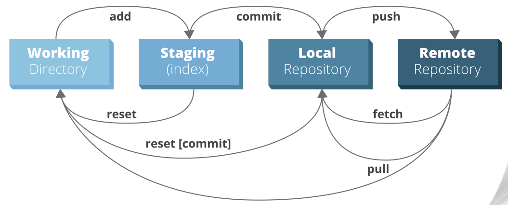
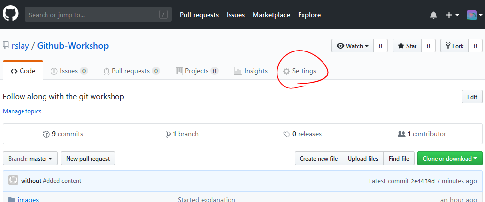
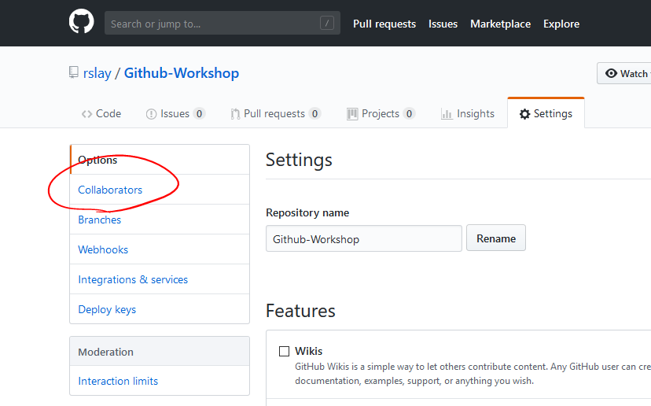
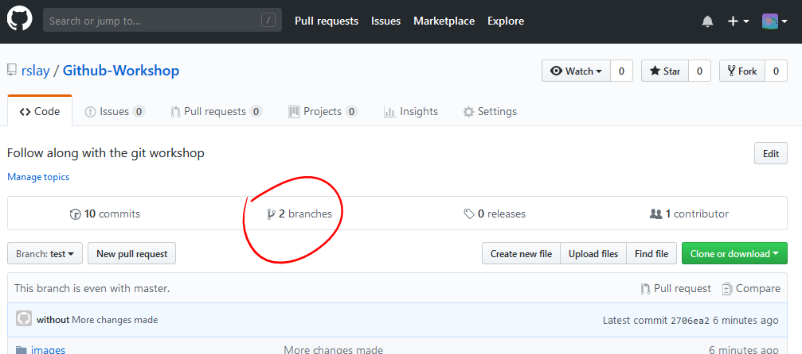
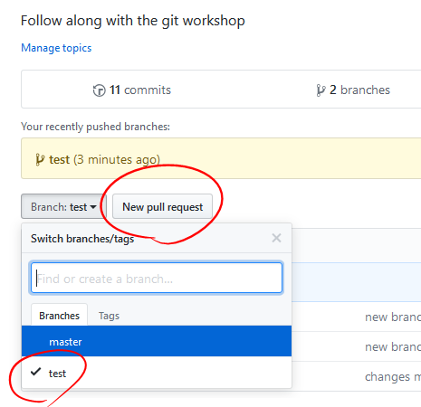
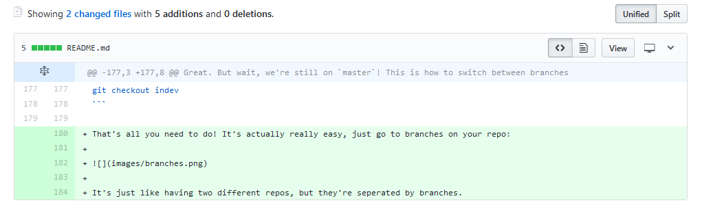
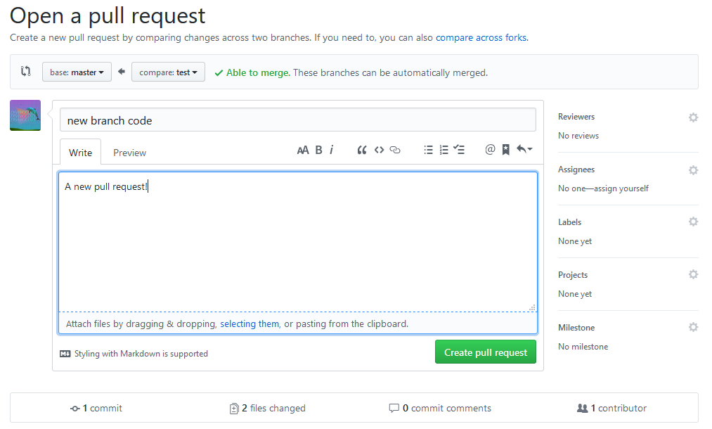
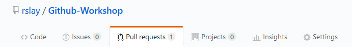
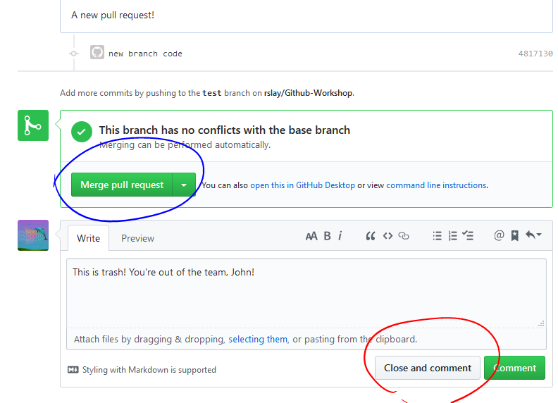

# Getting started
## Installation
### The simplest way to install `git`, the fastest tool for working on the same code together in a team, visit:
- [https://git-scm.com/download/win](https://git-scm.com/download/win) for Windows
- [https://git-scm.com/download/mac](https://git-scm.com/download/mac) for MacOS

Once installed, open up your Powershell terminal on:
- Windows by pressing `Win`+`R` and typing `powershell`, then hit `Enter`
- Mac by opening `Terminal.app`, which is inside the Utilities folder of launchpad

You'll want to pin the terminal to your dock/taskbar so you can open it easily later.

Type in `git` and hit `Enter` (you always press `Enter` at the end of a command in your terminal). If you see a bunch of explanatory text - good job, you installed it correctly!

## Using git
With your terminal open, visit [this site](https://ndpsoftware.com/git-cheatsheet.html), it's an interactive git cheatsheet that will explain everything in depth.

In short, you start off with your workspace (the folder where all your code is) and make changes there, and then you add it to your index. Once you have all files you want to update or upload to github in your index so your team can download it, you commit the changes. When you have enough commits done, you push the code to github.

### Lets start!

Go to github and create a new repo by clicking on the `+` sign in the top right and picking "New repository". You'll be taken to a page where you can enter the name and description of the repo. 

Take a look at the url on your browser now - this is where your code will live.

Open up your terminal and you see this:

```
C:\Users\Username\Desktop
> 
```

Next step is to copy the url of your repo, and then go into your terminal and type `cd Desktop` to change into your desktop. One you do that, you can type `ls` or `dir` on Windows to list all the files on your desktop. This is how to move around and look at files on your machine through the terminal.


Now that you have your reposity url copied, paste it after another command, `git clone`, like so:

```
git clone <your repository url>
```

You should have a new folder on your desktop, and since your repo should be empty, so should the folder. Type `cd <folder name>` to go into the folder, from your terminal.

Make a new file in the folder (use `touch <filename>` on mac), and then open it with your preferred editor.

As you make new files or make changes to existing ones, the code on your local repository will need to be synced with the code online in github.com.

Once you have changes or new files in your repo after coding, type in:

```
git status
```

This will show you a lot of useful information on the current changes and differences you have with the online repo, and `git diff` will be more in-depth.

However, you might not be up-to-date with the latest changes on the remote repo on github, so to keep your current work while also being able to update and see differences, use `git fetch`.

Next step is to add your changes to your **Index**, also known as the stage. This is where code goes when you modify it and want to make a new commit that will be visible on the repo.

Do this by typing:

```
git add <filename>
```

Or more often than not, if you want to add every file, you can use a dot, which meants **all files** in the folder:

```
git add .
```

To take files out of the **Index**, use:

```
git reset <filename>
```

You can use a dot in place of a filename to do it with everything the same way you do with adding:

```
git reset .
```

Before you do any commits, you'll want to run these commands to configure your identity with `git`:

```
git config --global user.name "<your github username>"
git config --global user.email "<your github email>"
```

Once files have been added, you can type the following to commit all your changes:

```
git commit -m "This is a message that people will see on github"
```

A commit is like an 'update'. Whether it be to fix typos or add a new feature to your project, it contains changes bunched up into removed and added lines of code.



This is all happening on your computer's local repository, though, so it's time to upload these commits to the internet - to github.com.

Before you do that, your team might have made changes, too. You'll need to first pull in the latest changes to your local repo from the remote repo:

```
git pull
```

If your team wasn't working on the same lines of code as you, and there are no conflicts, you will have the latest code online automatically merged with your computer's code.

**Before the next step**: Make sure your program runs/website is working! Sometimes people will edit code that will inadvertently affect what you have on your machine, because you've made changes on your computer they couldn't account for.

Now that everything is ready and your current project is working, upload it to github.com by doing:

```
git push
```

### *Radical!*

You did it. Next, your team will need to do `git pull` with their terminals open to the local repo on their folder.

But wait, how do you add people to be able to code on your repo?

Go to your settings in the repo: 



and on the left-hand side, open collaborators:



There, you'll enter your team member's usernames.

After that, your team will be able to type `git clone <repo url>` and `cd` into the folder, and run commands just like you.

## Collaboration and Branching

So now your team is working on code, but you'll run into merge conflicts, where your team has edited the same lines of code you have, and git doesn't want to make assumptions when combining your code. 

It'll look like this:

```
Auto-merging file.txt
CONFLICT (content): Merge conflict in file.txt
Automatic merge failed; fix conflicts and then commit the result.
```

If you open the file, you'll see both conflicting changes next to each other, sort of like this:

```
<<<<<<< HEAD
A line in my file.
=======
A line in someone else's.
>>>>>>> 031389f2cd2acde08e32f0beb084b2f7c3257ffe
```

The `=======` divides them. Edit everything between the arrows, and do:
- `git add <filename>`
- `git commit -m "Message"`, 
- ...and if everything is looking good, do `git push`.

 **However, this can get tedious and time consuming.**

So instead, we can use *branches*.

Everything you've been doing up to this point has been on the `master` branch. It's the default branch, and the one you'll want to keep away from bugs and make sure is working, for people to be able to easily do `git clone` and have a copy of it.

So now, we'll be making a new branch, with a different name. Lets call it `indev`. This is how we create it:

```
git branch indev
```

Great. But wait, we're still on `master`! This is how to switch between branches:

```
git checkout indev
```

That's all you need to do! It's actually really easy, just go to branches on your repo:



You can delete them there.

Having branches is just like having two different repos, but their code is seperated.

After doing commits, you're supposed to merge all the changes of a branch into `master`. On github.com, select your non-`master` branch, and when you're ready, select to create a new pull request:



This is where you review what will happen when github merges the two branches.

Go over all of that by scrolling down to this part:



After you resolve all issues, you'll be able to click on the green "Create pull request" button.



Now that you've requested for this branch to be merged, you or another team can look at the pull requests here:



You can review the PR and have your team comment before either merging the branch and bringing it into `master`, or closing it with a comment about why it won't be merged.



Once it's done, your non-`master` branch will combine into the `master` branch. Don't forget to delete the old non-`master` branch.

That's it! You are now ready to take on big projects. 

Don't forget, *everyone makes mistakes*. You learn by practice, and git is very forgiving, since **you can go backward in time and undo almost everything**.

And when you do mess up, your team will be able to see it all, with:

```
git blame <filename>
```

Which shows all code and changes.

Here is a link to that [interactive manual](https://ndpsoftware.com/git-cheatsheet.html) again, where you can click on and see everything in detail and see all the commands. No need to memorize anything.


## Help! Something broke! It's not working!
Bookmark [ohshitgit.com](https://ohshitgit.com/) to find quick help and solutions to common problems.
